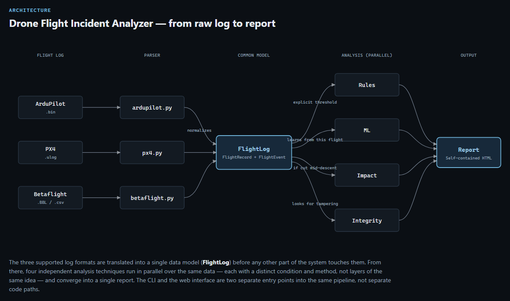

# Drone Flight Incident Analyzer

[Español](README.md) · **English**


[](LICENSE)

**Live demo: [drone-flight-incident-analyzer.onrender.com](https://drone-flight-incident-analyzer.onrender.com)**
(free tier: if it's been idle for a while, the first load takes ~30-50s)

Forensic analysis tool for drone flight logs. Ingests telemetry logs in the
three most common open formats used by real autopilots (**ArduPilot**
`.bin`, **PX4** `.ulog`, **Betaflight** blackbox `.BBL`/CSV), reconstructs
the flight path, detects anomalies, estimates where and how a flight whose
log cut off mid-descent likely impacted, checks for signs of log tampering,
cross-references the flight with recorded video (DJI SRT), and compares
several flights at once in a fleet dashboard — all as self-contained HTML
reports.

<p align="center">
  
</p>

<p align="center">
  
  
</p>

The full report — not just the upload page — is generated in the language
you pick, including the description of each individual finding:

<p align="center">
  
  
  
</p>

## Motivation

With the rise in downed/crashed drones (both civilian and military use),
extracting and analyzing their flight logs is today done mostly by hand,
case by case. There's barely any open tooling that automates "raw log →
incident report." This project is an exploration of that problem: it
doesn't aim to be a certified forensic tool, but rather to demonstrate how
the pipeline of a real incident analyzer would be designed.

## Capabilities

- **Multi-format parsing**: ArduPilot, PX4, Betaflight → a common data model.
- **Explainable rule-based anomaly detection**: GPS glitches, sharp
  descents, battery voltage drops, RC signal loss (`src/analysis/anomalies.py`).
- **Machine-learning anomaly detection**: an Isolation Forest trained only
  on THIS flight's data flags statistically rare patterns that no
  predefined rule covers (e.g. an anomalous combination of attitude +
  speed). Each finding states which specific metric deviated the most, so
  it isn't a black box (`src/analysis/ml_anomalies.py`).
- **Impact estimation**: when the log cuts off mid-descent (the typical
  case: the drone loses power on impact), it projects with basic
  kinematics where and at what speed it likely hit, with explicit stated
  assumptions (`src/analysis/impact.py`).
- **Integrity verification**: heuristic signs of a tampered or corrupted
  log — per-sensor time reversals, abnormally large gaps
  (`src/analysis/integrity.py`). Not cryptographic proof, just a signal.
- **Video synchronization**: cross-references the SRT subtitles of a DJI
  video (which carry GPS/altitude per frame) with the flight log, including
  a cross-check of GPS position between the two independent sources
  (`src/parsers/dji_srt.py`, `src/analysis/video_sync.py`).
- **Fleet dashboard**: analyzes several logs at once — a map with all
  routes overlaid, a histogram of the most frequent anomaly category
  across the set, a comparison table (`src/report/fleet.py`).
- **Web interface**: upload the file(s) from the browser and see the
  report directly, no terminal needed (`src/web/`, FastAPI).

**On the ML detection**: it's trained from scratch on every single flight
(there's no model shared or pre-trained across flights), with a fixed seed
so the same log always yields the same result. It needs a minimum of ~20
resampled data points and at least 2 numeric metrics present in the log to
produce something reliable; if it doesn't have that, it produces no result
instead of forcing an unreliable one. In the report, every finding carries
an "ML" tag (versus "rule") to make clear it's a statistical pattern, not a
justifiable threshold, and deserves more human review. Important nuance
(documented after writing the tests): Isolation Forest with a fixed
`contamination` always flags ~that fraction of points as anomalous, even in
a perfectly normal flight — there's no "zero false positives" guarantee,
it's a property of the algorithm.

## Architecture

<p align="center">
  
</p>

File-level detail:

```
log (.bin / .ulog / .BBL / .csv)
        │
        ▼
   src/pipeline.py  (format detection, shared by CLI and web)
        │
        ▼
   src/parsers/*  ──►  FlightLog (common data model)
        │                 │
        │                 ▼
        │          src/analysis/anomalies.py    (rule-based event detection)
        │          src/analysis/ml_anomalies.py (Isolation Forest detection)
        │          src/analysis/impact.py       (impact estimation)
        │          src/analysis/integrity.py    (tampering indicators)
        │          src/analysis/video_sync.py   (DJI video cross-reference, optional)
        │                 │
        ▼                 ▼
   src/analysis/trajectory.py  (map + timeline)
        │
        ▼
   src/report/generator.py  ──►  self-contained HTML report (1 flight)
   src/report/fleet.py       ──►  comparison dashboard (several flights)
        ▲
        │
   src/cli.py   (terminal)
   src/web/     (browser, FastAPI — same logic, different entry point)
```

The centerpiece of the design is `FlightLog` / `FlightRecord` / `FlightEvent`
(`src/parsers/base.py`): each parser translates its binary format into
these classes, and everything downstream (maps, anomalies, impact,
integrity, report) is completely agnostic to the source format.

## Supported formats and their limitations

| Format | Library used | Known limitation |
|---|---|---|
| ArduPilot (`.bin`) | `pymavlink` (official) | The `Mode` field in older logs can come as an undecoded number instead of a name (depends on firmware version/vehicle type) |
| PX4 (`.ulog`) | `pyulog` (official) | Logs without GPS/battery enabled in simulation don't generate those fields (the report degrades gracefully, without a map) |
| Betaflight (`.BBL`) | `blackbox_decode` (external) + custom CSV parser | No official Python library exists; requires `blackbox_decode` to be installed. Betaflight doesn't log absolute attitude by default, so roll/pitch/yaw aren't available for this format |
| DJI SRT (video) | `srt` + custom parser | Not officially documented by DJI and differs between generations; only two known variants are recognized. Syncing with the log requires a manual offset unless the log's real UTC start time is provided |

**Fleet mode**: `.bin` / `.ulog` / `.BBL` / `.csv` can be freely mixed in
the same batch — each file is auto-detected by its extension
independently, `--format` is only needed to force a specific format.

## Usage

```bash
python -m venv .venv
.venv\Scripts\activate      # Windows
pip install -r requirements.txt

# Individual report
python -m src.cli data/samples/ardupilot/flight.bin
python -m src.cli data/samples/px4/flight.ulog
python -m src.cli data/samples/betaflight/flight.BBL          # requires blackbox_decode on PATH
python -m src.cli data/samples/betaflight/flight.csv --format betaflight

# With vehicle mass, to compute impact kinetic energy
python -m src.cli data/samples/ardupilot/flight.bin --mass-kg 1.5

# Cross-referenced with DJI video (offset calibrated by hand, in seconds)
python -m src.cli data/samples/betaflight/flight.csv --format betaflight --video-srt flight.srt --video-offset 2.3

# Report in another language (es / en / de; defaults to es)
python -m src.cli data/samples/ardupilot/flight.bin --lang en

# Fleet dashboard (several logs at once)
python -m src.cli data/samples/ardupilot/*.bin --output output/fleet.html
```

The report is generated at `output/<log_name>.html` (or
`output/fleet_report.html` in fleet mode).

### Web interface

To avoid depending on the terminal: upload the file(s) from the browser
and the report is shown directly, with no intermediate steps.

```bash
python -m src.web
```

Open `http://127.0.0.1:8000` in your browser. It's a thin layer over the
same pipeline the CLI uses (`src/pipeline.py`, `src/analysis/*`,
`src/report/*`); deliberately reduced in scope compared to the CLI — it
doesn't include video synchronization (needs two correlated files and a
hand-calibrated offset, too much form for a first version).

**Rate limiting**: `/analyze` (the expensive endpoint — trains an ML model
per request) is limited to 20 requests/minute per IP (`slowapi`), so
Render's free tier doesn't run out of resources if someone hammers it. Past
the limit, it responds `429` instead of degrading or crashing.

**Language**: an ES/EN/DE switcher top-right, and an "i" button opening a
window that explains what the tool does, also in all 3 languages. The
upload page is a single page with all 3 translations embedded in
JavaScript (no reload), and the choice is remembered across visits
(`localStorage`). The chosen language also travels to the backend (a
hidden form field / the `--lang` CLI flag): the generated report — titles,
tables, and the description of each individual finding (e.g. "12.0 m/s
descent," rebuilt on the fly from its template, not just the fixed
structure) — comes out in the chosen language too (`src/report/i18n.py`).

**Deployed on [Render](https://render.com)** (free tier) via `render.yaml`:
**https://drone-flight-incident-analyzer.onrender.com**. No persistent
state to manage (each analysis is processed in a temporary directory that
gets deleted once the request finishes), so no database or disk is needed.
To redeploy from scratch: "New +" → "Blueprint" on Render → select this
repository → Render detects `render.yaml` on its own.

## Tests

```bash
pytest -v
```

84 tests covering the seven `src/analysis/` modules, the four parsers, the
translation module (`src/report/i18n.py`), the CLI, the web interface, and
end-to-end malformed-input cases, using small fixtures versioned in
`tests/fixtures/` (a real 64 KB ArduPilot excerpt, a real ~900 KB PX4 log,
synthetic CSVs/SRT, and empty/corrupt files in `tests/fixtures/malformed/`)
— none of them depend on downloading anything external, so they run the
same locally and in CI. They run automatically on every `push` via GitHub
Actions (`.github/workflows/tests.yml`), on Ubuntu and Windows.

## Code quality

```bash
ruff check .        # lint
ruff format .       # formatting
mypy src/           # static type checking
```

Configured in `pyproject.toml`. Checked automatically on every `push` (a
`lint` job separate from the tests job). `mypy` is configured to ignore
missing *type stubs* for third-party libraries that don't publish them
(`pymavlink`, `pyulog`, `srt`, `scikit-learn`, `folium`, `pandas`,
`plotly`) — that's not our code to type — and checks the rest precisely.
Along the way it caught several real cases where the `float | None` type of
`FlightRecord`'s optional fields (not every format carries every field, see
`src/parsers/base.py`) was used as if it were `float` without checking
first; these were resolved with explicit `assert` statements exactly where
a prior filter already guarantees it isn't `None`, leaving that reasoning
documented in the code itself instead of implicit.

It also caught, in passing, two real file-descriptor leaks (the ArduPilot
reader and the `blackbox_decode` subprocess weren't closing the file
explicitly), now fixed.

**Test coverage**: 94% (`pytest --cov=src`), with a CI threshold of 85% as
a safety net against a major drop, not as a line-by-line target to chase.

**Robustness against malformed files**: uploading an empty file, a corrupt
one, or one with the wrong extension always produces a clear error message
(never a traceback or a 500) — see `tests/test_malformed_inputs.py`.
Testing uncovered that `pymavlink` and `pyulog` open the file before
validating its contents and don't close it if that validation fails
partway through building their reader; on Windows that blocked deleting the
temp file right after the error. Fixed by validating each format's header
by hand before handing it to the library, avoiding the root cause.

## Test data

Sample logs aren't versioned in git (see `data/samples/README.md` for
public sources to download them from). The pipeline has been tested
against:
- A real ArduPilot log (`ArduPilot/pymavlink` test fixtures)
- A real PX4 log (`PX4/pyulog` test fixtures)
- A synthetic CSV with `blackbox_decode`'s real column schema (no publicly
  downloadable real `.BBL`/CSV was found without the `blackbox_decode`
  binary)
- A synthetic `.srt` with the real DJI subtitle format (no real DJI
  video/flight was available for testing)

## What this project deliberately does NOT do

It deliberately includes nothing related to targeting, guidance, or flight
control: it's a post-flight (post-incident) analysis tool, not a
real-time operation one. The impact estimate is basic physics (free-fall
kinematics), not a damage or lethality model.

## Possible extensions

- Capture the log's real UTC start time in the parsers (ArduPilot and PX4
  have it available internally) to automatically align video without a
  manual offset.
- Real terrain (elevation model) instead of "flat terrain" in the impact
  estimate — very relevant in alpine environments.
