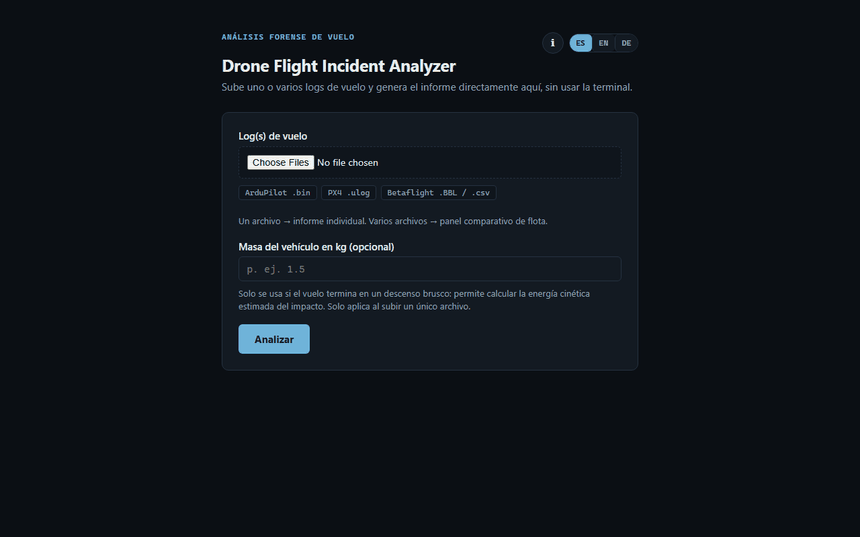
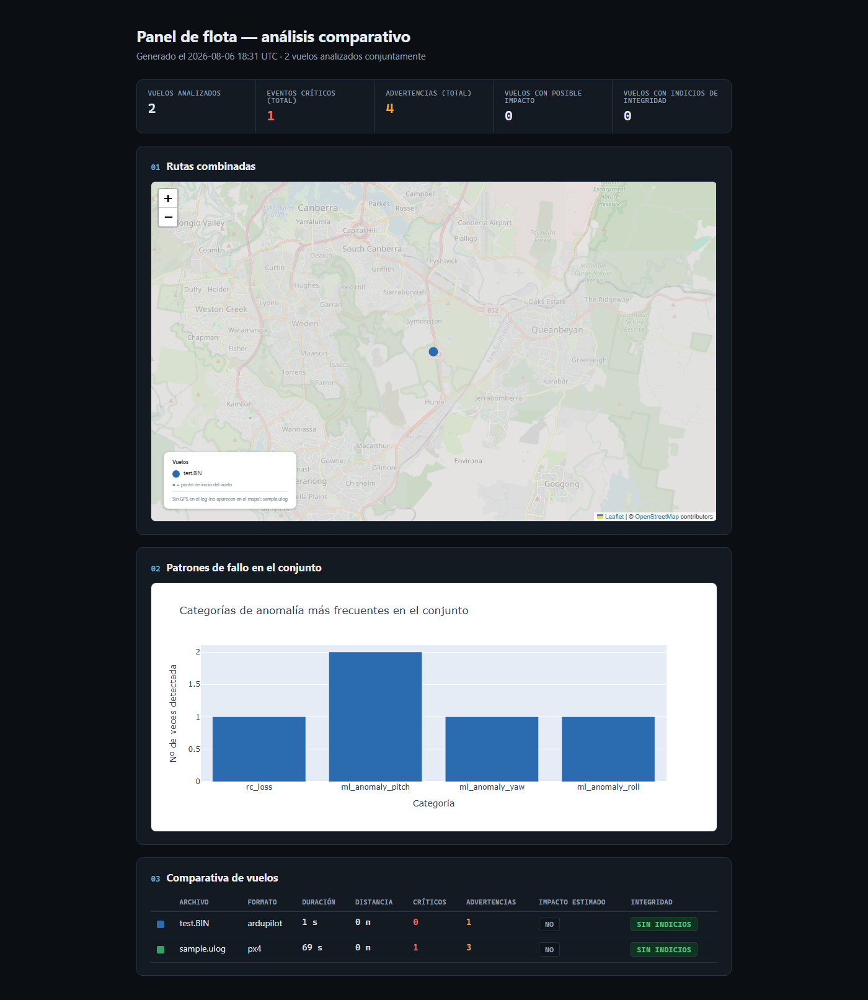
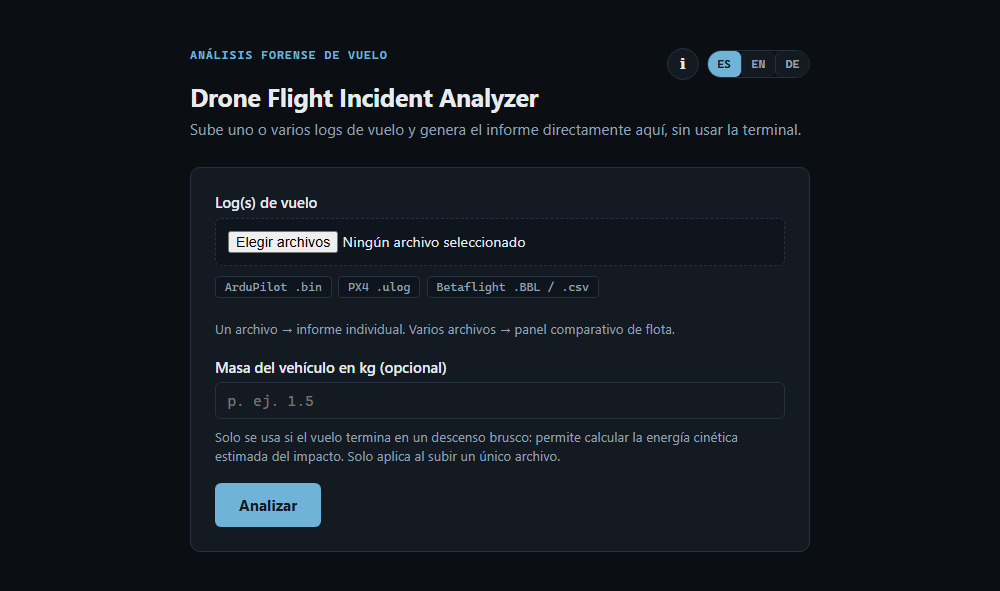
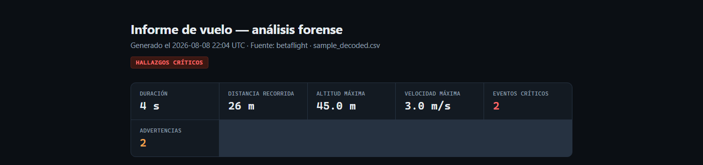
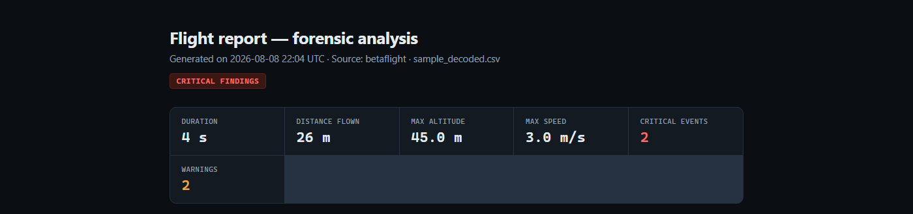
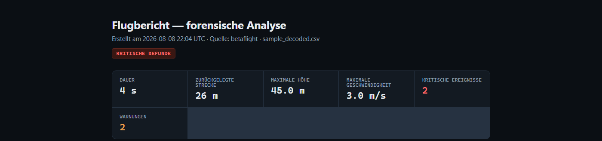
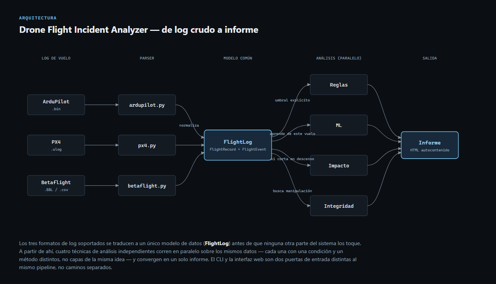

# Drone Flight Incident Analyzer

**Español** · [English](README.en.md)


[](LICENSE)

**Demo en vivo: [drone-flight-incident-analyzer.onrender.com](https://drone-flight-incident-analyzer.onrender.com)**
(plan gratuito: si lleva un rato dormido, la primera carga tarda ~30-50s)

Herramienta de análisis forense de logs de vuelo de drones. Ingiere logs de
telemetría en los tres formatos abiertos más usados en autopilotos reales
(**ArduPilot** `.bin`, **PX4** `.ulog`, **Betaflight** blackbox `.BBL`/CSV),
reconstruye la trayectoria de vuelo, detecta anomalías, estima dónde y cómo
impactó un vuelo cuyo log se cortó en pleno descenso, verifica indicios de
manipulación del propio log, cruza el vuelo con el vídeo grabado (DJI SRT),
y compara varios vuelos a la vez en un panel de flota — todo en informes
HTML autocontenidos.

<p align="center">
  
</p>

<p align="center">
  
  
</p>

El informe completo — no solo la web de subida — se genera en el idioma
elegido, incluida la descripción de cada hallazgo concreto:

<p align="center">
  
  
  
</p>

## Motivación

Con el aumento de drones derribados/estrellados (uso civil y militar), la
extracción y el análisis de sus logs de vuelo se hace hoy en gran medida a
mano, caso por caso. No existe apenas tooling abierto que automatice
"log crudo → informe de incidente". Este proyecto es una exploración de ese
problema: no pretende ser una herramienta forense certificada, sino
demostrar cómo se diseñaría el pipeline de un analizador de incidentes real.

## Capacidades

- **Parseo multi-formato**: ArduPilot, PX4, Betaflight → un modelo de datos común.
- **Detección de anomalías por reglas explicables**: glitches de GPS, descensos
  bruscos, caídas de batería, pérdida de señal RC (`src/analysis/anomalies.py`).
- **Detección de anomalías por machine learning**: un Isolation Forest entrenado
  solo con los datos de ESTE vuelo señala patrones estadísticamente raros que
  ninguna regla predefinida cubre (p. ej. una combinación anómala de actitud +
  velocidad). Cada hallazgo indica qué magnitud concreta se desvió más, para no
  ser una caja negra (`src/analysis/ml_anomalies.py`).
- **Estimación de impacto**: cuando el log se corta en pleno descenso (el caso
  típico: el dron pierde alimentación al chocar), proyecta con cinemática
  básica dónde y a qué velocidad probablemente impactó, con sus asunciones
  explícitas (`src/analysis/impact.py`).
- **Verificación de integridad**: indicios heurísticos de log manipulado o
  corrupto — retrocesos de tiempo por sensor, huecos anormalmente grandes
  (`src/analysis/integrity.py`). No es una prueba criptográfica, es una señal.
- **Sincronización con vídeo**: cruza los subtítulos SRT de un vídeo DJI (que
  llevan GPS/altitud por fotograma) con el log de vuelo, incluyendo una
  verificación cruzada de GPS entre las dos fuentes independientes
  (`src/parsers/dji_srt.py`, `src/analysis/video_sync.py`).
- **Panel de flota**: analiza varios logs a la vez — mapa con todas las rutas
  superpuestas, histograma de qué anomalía es más frecuente en el conjunto,
  tabla comparativa (`src/report/fleet.py`).
- **Interfaz web**: subir el/los archivo(s) desde el navegador y ver el
  informe directamente, sin usar la terminal (`src/web/`, FastAPI).

**Sobre la detección por ML**: se entrena desde cero con cada vuelo (no hay un
modelo compartido entre vuelos ni pre-entrenado), con semilla fija para que el
mismo log dé siempre el mismo resultado. Necesita un mínimo de ~20 muestras
remuestreadas y al menos 2 magnitudes numéricas presentes en el log para
producir algo fiable; si no los hay, no da resultado en vez de forzar uno poco
fiable. En el informe, cada hallazgo lleva una etiqueta "ML" (frente a "regla")
para dejar claro que es un patrón estadístico, no un umbral justificable, y
merece más revisión humana. Matiz importante (documentado tras escribir los
tests): Isolation Forest con `contamination` fijo siempre marca ~esa fracción
de puntos como anómalos, incluso en un vuelo perfectamente normal — no hay
garantía de "cero falsos positivos", es una propiedad del algoritmo.

## Arquitectura

<p align="center">
  
</p>

Detalle a nivel de archivo:

```
log (.bin / .ulog / .BBL / .csv)
        │
        ▼
   src/pipeline.py  (deteccion de formato, compartida por CLI y web)
        │
        ▼
   src/parsers/*  ──►  FlightLog (modelo de datos común)
        │                 │
        │                 ▼
        │          src/analysis/anomalies.py    (detección de eventos por reglas)
        │          src/analysis/ml_anomalies.py (detección por Isolation Forest)
        │          src/analysis/impact.py       (estimación de impacto)
        │          src/analysis/integrity.py    (indicios de manipulación)
        │          src/analysis/video_sync.py   (cruce con vídeo DJI, opcional)
        │                 │
        ▼                 ▼
   src/analysis/trajectory.py  (mapa + timeline)
        │
        ▼
   src/report/generator.py  ──►  informe HTML autocontenido (1 vuelo)
   src/report/fleet.py       ──►  panel comparativo (varios vuelos)
        ▲
        │
   src/cli.py   (terminal)
   src/web/     (navegador, FastAPI — misma logica, otra entrada)
```

La pieza central del diseño es `FlightLog` / `FlightRecord` / `FlightEvent`
(`src/parsers/base.py`): cada parser traduce su formato binario a estas
clases, y todo lo que viene después (mapas, anomalías, impacto, integridad,
informe) es completamente agnóstico del formato de origen.

## Formatos soportados y sus limitaciones

| Formato | Librería usada | Limitación conocida |
|---|---|---|
| ArduPilot (`.bin`) | `pymavlink` (oficial) | El campo `Mode` en logs antiguos puede venir como número sin decodificar a nombre (depende de la versión/tipo de vehículo) |
| PX4 (`.ulog`) | `pyulog` (oficial) | Logs sin GPS/batería habilitados en la simulación no generan esos campos (el informe se degrada con gracia, sin mapa) |
| Betaflight (`.BBL`) | `blackbox_decode` (externo) + parser CSV propio | No hay librería Python oficial; requiere tener `blackbox_decode` instalado. Betaflight no registra actitud absoluta por defecto, así que roll/pitch/yaw no están disponibles para este formato |
| DJI SRT (vídeo) | `srt` + parser propio | Formato no documentado oficialmente por DJI y distinto entre generaciones; solo se reconocen dos variantes conocidas. La sincronización con el log requiere un offset manual salvo que se aporte la hora UTC real de inicio del log |

**Modo flota**: se puede mezclar libremente `.bin` / `.ulog` / `.BBL` / `.csv`
en la misma tanda — cada archivo se auto-detecta por su extensión de forma
independiente, `--format` ya no hace falta salvo para forzar un formato
concreto.

## Uso

```bash
python -m venv .venv
.venv\Scripts\activate      # Windows
pip install -r requirements.txt

# Informe individual
python -m src.cli data/samples/ardupilot/vuelo.bin
python -m src.cli data/samples/px4/vuelo.ulog
python -m src.cli data/samples/betaflight/vuelo.BBL          # requiere blackbox_decode en el PATH
python -m src.cli data/samples/betaflight/vuelo.csv --format betaflight

# Con masa del vehiculo, para calcular energia cinetica de impacto
python -m src.cli data/samples/ardupilot/vuelo.bin --mass-kg 1.5

# Cruzando con video DJI (offset calibrado a mano, en segundos)
python -m src.cli data/samples/betaflight/vuelo.csv --format betaflight --video-srt vuelo.srt --video-offset 2.3

# Informe en otro idioma (es / en / de; por defecto es)
python -m src.cli data/samples/ardupilot/vuelo.bin --lang en

# Panel de flota (varios logs a la vez)
python -m src.cli data/samples/ardupilot/*.bin --output output/flota.html
```

El informe se genera en `output/<nombre_del_log>.html` (o `output/fleet_report.html` en modo flota).

### Interfaz web

Para no depender de la terminal: sube el/los archivo(s) desde el navegador y
el informe se muestra directamente, sin pasos intermedios.

```bash
python -m src.web
```

Abre `http://127.0.0.1:8000` en el navegador. Es una capa fina sobre el
mismo pipeline que el CLI (`src/pipeline.py`, `src/analysis/*`,
`src/report/*`); alcance reducido a propósito respecto al CLI — no incluye
la sincronización con vídeo (necesita dos archivos correlacionados y un
offset calibrado a mano, demasiado formulario para una primera versión).

**Límite de peticiones**: `/analyze` (el endpoint caro — entrena un modelo
de ML por petición) está limitado a 20 peticiones/minuto por IP (`slowapi`),
para que el plan gratuito de Render no se quede sin recursos si alguien lo
satura. Pasado el límite, responde `429` en vez de degradarse o caerse.

**Idioma**: selector ES/EN/DE arriba a la derecha, y un botón "i" con una
ventana explicando qué hace la herramienta, también en los 3 idiomas. La
página de subida es una única página con las 3 traducciones embebidas en
JavaScript (sin recargar), y la elección se recuerda entre visitas
(`localStorage`). El idioma elegido viaja también al backend (campo oculto
del formulario / flag `--lang` en el CLI): el informe generado — títulos,
tablas, y la descripción de cada hallazgo concreto (p. ej. "descenso de
12.0 m/s", reconstruida en el momento a partir de su plantilla, no solo la
estructura fija) — sale igualmente en el idioma elegido (`src/report/i18n.py`).

**Desplegado en [Render](https://render.com)** (plan gratuito) vía `render.yaml`:
**https://drone-flight-incident-analyzer.onrender.com**. Sin estado
persistente que gestionar (cada análisis se procesa en un directorio
temporal que se borra al terminar la petición), así que no hace falta
ninguna base de datos ni disco. Para volver a desplegarlo desde cero:
"New +" → "Blueprint" en Render → seleccionar este repositorio → Render
detecta `render.yaml` solo.

## Tests

```bash
pytest -v
```

84 tests que cubren los siete módulos de `src/analysis/`, los cuatro
parsers, el módulo de traducción (`src/report/i18n.py`), el CLI, la interfaz
web y casos de entrada malformada de extremo a extremo, usando fixtures
pequeños versionados en `tests/fixtures/` (un
recorte real de ArduPilot de 64 KB, un log real de PX4 de ~900 KB, CSVs/SRT
sintéticos, y archivos vacíos/corruptos en `tests/fixtures/malformed/`) — no
dependen de descargar nada externo, así que corren igual en local que en
CI. Se ejecutan automáticamente en cada `push` vía GitHub Actions
(`.github/workflows/tests.yml`), en Ubuntu y Windows.

## Calidad de código

```bash
ruff check .        # lint
ruff format .       # formato
mypy src/           # comprobación estática de tipos
```

Configurado en `pyproject.toml`. Se comprueba automáticamente en cada `push`
(job `lint` separado del de tests). `mypy` está configurado para ignorar la
falta de *type stubs* de las librerías de terceros que no los publican
(`pymavlink`, `pyulog`, `srt`, `scikit-learn`, `folium`, `pandas`, `plotly`)
— no es código nuestro que debamos tipar — y comprueba con precisión el
resto. De paso detectó varios casos reales donde el tipo `float | None` de
los campos opcionales de `FlightRecord` (no todos los formatos traen todos
los campos, ver `src/parsers/base.py`) se usaba como si fuera `float` sin
comprobar antes; se resolvieron con `assert` explícitos justo donde el
filtro previo ya garantiza que no es `None`, dejando ese razonamiento
documentado en el propio código en vez de implícito.

También detectó de paso dos fugas reales de descriptor de archivo (el
lector de ArduPilot y el subproceso de `blackbox_decode` no cerraban el
archivo explícitamente), ya corregidas.

**Cobertura de tests**: 94% (`pytest --cov=src`), con un umbral de CI en 85%
como red de seguridad ante una caída grande, no como objetivo a perseguir
línea a línea.

**Robustez ante archivos raros**: subir un archivo vacío, corrupto, o con la
extensión equivocada siempre produce un mensaje de error claro (nunca un
traceback ni un 500) — ver `tests/test_malformed_inputs.py`. Se descubrió
durante las pruebas que `pymavlink` y `pyulog` abren el archivo antes de
validar su contenido y no lo cierran si esa validación falla a mitad de
construir su lector; en Windows eso bloqueaba borrar el archivo temporal
justo después del error. Se corrigió validando la cabecera de cada formato
a mano antes de pasárselo a la librería, evitando el problema de raíz.

## Datos de prueba

Los logs de ejemplo no se versionan en git (ver `data/samples/README.md`
para las fuentes públicas de donde descargarlos). El pipeline ha sido
probado contra:
- Un log real de ArduPilot (`ArduPilot/pymavlink` test fixtures)
- Un log real de PX4 (`PX4/pyulog` test fixtures)
- Un CSV sintético con el esquema de columnas real de `blackbox_decode`
  (no se encontró un `.BBL`/CSV real descargable públicamente sin el
  binario `blackbox_decode`)
- Un `.srt` sintético con el formato real de subtítulos DJI (no se disponía
  de un vídeo/vuelo DJI real para pruebas)

## Qué NO hace este proyecto

Deliberadamente no incluye nada relacionado con targeting, guiado o control
de vuelo: es una herramienta de análisis posterior al vuelo (post-incident),
no de operación en tiempo real. La estimación de impacto es física básica
(cinemática de caída libre), no un modelo de daño ni de letalidad.

## Posibles extensiones

- Capturar la hora UTC real de inicio del log en los parsers (ArduPilot y
  PX4 la tienen disponible internamente) para poder alinear automáticamente
  el vídeo sin offset manual.
- Terreno real (modelo de elevación) en vez de "terreno llano" en la
  estimación de impacto — muy relevante en entornos alpinos.
